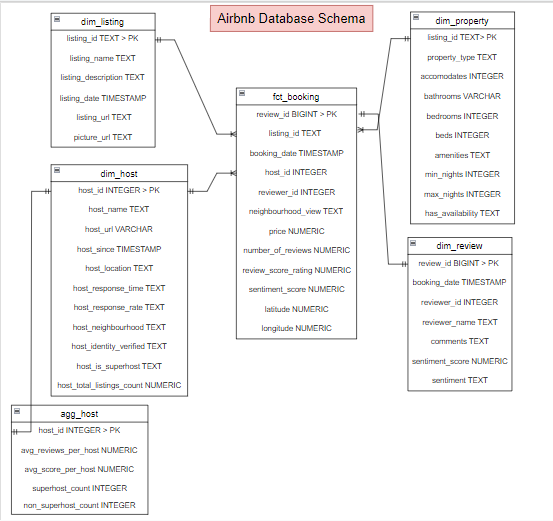
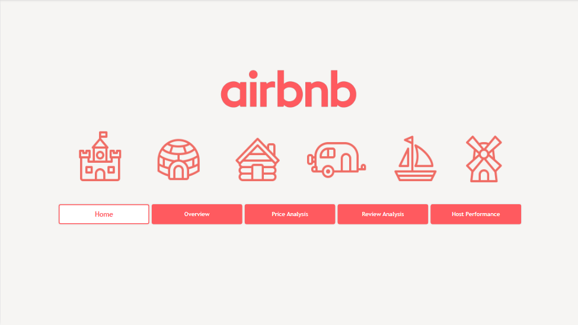
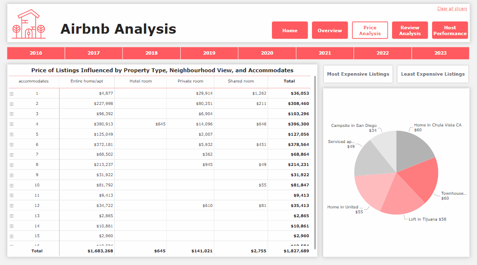
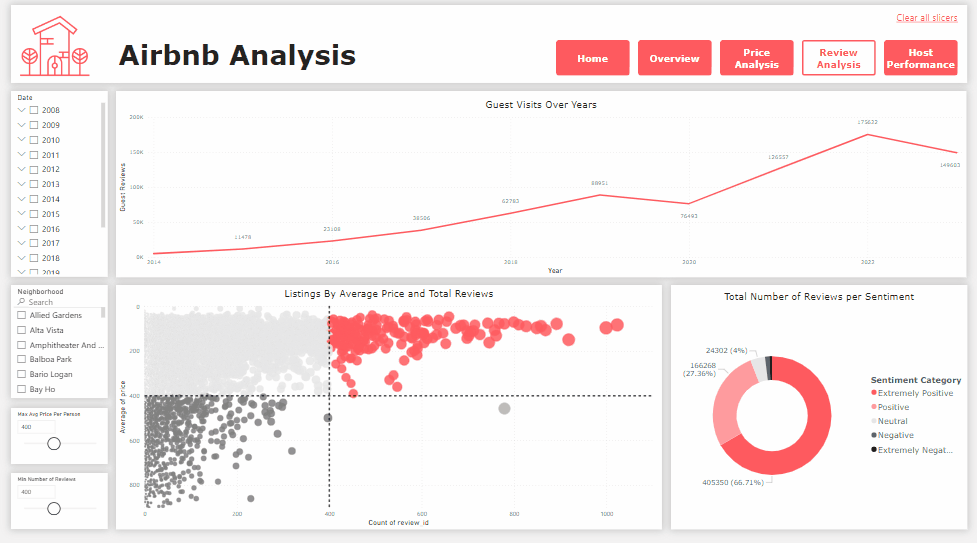
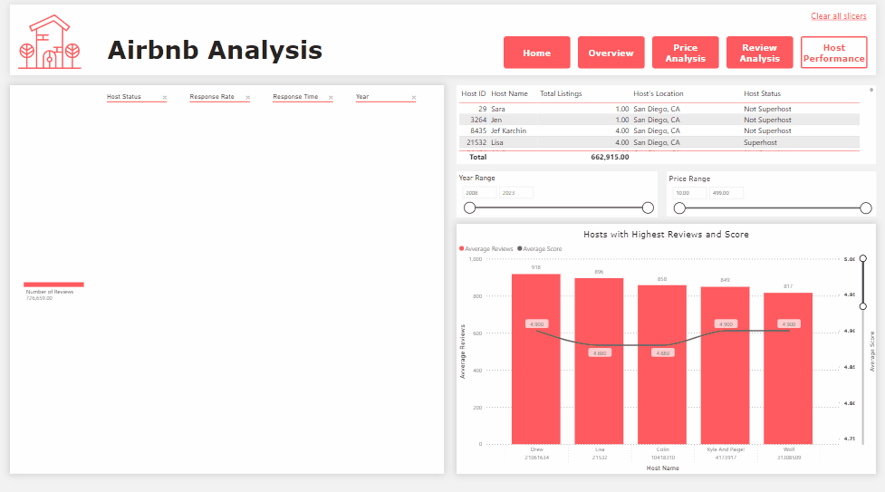

> Hello! This is our project’s summary that describes the project, plain and simple, limited to the space available.
> The Project was done by two enthusiastic Data Science students; Zahraa Dokmak and Sara Dokmak as their Final Year Project.
**[PROJECT PHILOSOPHY](#project-philosophy) • [PROTOTYPING](#prototyping) • [TECH STACKS](#stacks) • [IMPLEMENTATION](#demo)**

 
  

  

<!-- project philosophy -->

> A Python-based ETL project that extracts, transforms, and loads data from various resources into a tabular database (PostgreSQL). This project's objective is to offer a comprehensive analysis of the San Diego Airbnb market, enabling insights into property pricing, host performance, and guest reviews. 

 

  

### User Types

 

1. Data Engineers.
2. Data Analysts.
3. Airbnb Hosts.
4. Travelers/Guests.
5. Business Owners.
  

 

  

### User Stories

  
1. As a Data Engineer:  
	- We want to automatically extract Airbnb data from reputable sources so that our dataset is always up-to-date.  
	- We want to integrate different data sources seamlessly.  
	- Ensure fault tolerance in our data pipelines, so that potential failures don't interrupt our analyses.  
2. As an Analyst:  
	- We want to query the database.  
	- We want to view the sentiment analysis results to understand guest sentiment around Airbnb experience.  
	- We want to visualize the data using PowerBI.  
3. As an Airbnb Host:  
	- We want to access market insights so that we can optimize my property listings and pricing strategies.  
	- We want to review guest sentiment analysis results so that We can improve the overall guest experience in my listings.  
4. As a Traveler/Guest:  
	- We want to use this data to make decisions when selecting accommodations.  
	- We want to understand pricing trends so that We can make budget-conscious choices.  
5. As a Business Owner:  
	- We want to conduct competitive analyses using this data so that we can stay competitive in the market.  
	- We want to understand guest review sentiments.  
	- We want to use market insights for tailored services and marketing efforts so that my business aligns with customer expectations and attracts more clients.  

  

<!-- Prototyping -->

> We designed our project to perform ETL processes, integrate data, and include it in a PowerBI Sample Dashboard.
  

### Data Flow Diagram

  

  

<!-- Implementation -->

  

### Dashboard Screen

### Report Screenshots

| Home Page |
| ----------|
| |
 

 

| Overview |
| ----------| 
| | 

   
  
| Price Analysis |
| ----------|
| | 

  
 

| Review Analysis |
| ----------| 
| | 

<!-- ||||| -->
<!-- <video width="640" height="360" controls>
  <source src="./screenshots/recording_airbnb_2.mp4" type="video/mp4">
  Your browser does not support the video tag.
</video> -->

   
 
| Host Performance |
| ----------|
| | 

 

| Full Dashboard |
| ----------|

https://github.com/ZahraaDk/Airbnb-Full-Stack-Data-Analysis-Project/assets/141562480/74d4d408-76bd-4684-adf3-92df69652bb8

  

  

<!-- Tech stacks -->

## Frontend

Interactive PowerBI Dashboard:  
A central dashboard where viewers can check:  

1. Airbnb Insights: Graphs, charts and visualizations displaying key insights into the Airbnb market over time, along with key influencers that aid in the understanding of the analysis.
2. Sentiment Analysis: Representations of guest review sentiments for Airbnb experiences using interactive representations including scatter diragram, pie chart, tooltip(for detailed information), and line graph, with the ability to filter through date and demographic areas. 
3. Host Performance: Decomposition tree, line and stacked column chart where the user can filter by price, year, and average score for a better view of the chart. 
4. Interactive filters: Options to filter data by date, region, price, and number of reviews. 

  

 

  

## Backend

1. ETL Pipeline: Using Python and pandas, raw data is extracted from online resources that are frequently updated, transformed into a usable format and loaded into PostgreSQL database, with the focus on data that aids my analysis.
2. Database: Schema Design - Indexing - Data Integrity - Backup & Recovery.
3. Data Quality Assurance: Using pandas, data validation and cleaning steps are implemeted in my ETL pipeline. Ensuring that the data extracted and transformed is accurate and consistent.
4. Logging and Monitoring: Logging and monitoring of the ETL pipeline is implemented to track its performance, identify issues, and ensure that it runs smoothly.
5. Sentiment Analysis: Sentiment analysis is applied in the ETL process to extract sentiment from the reviews using the VADER tool in NLTK. 

  
  

As for the dashboard access: Please use [this link](https://app.powerbi.com/view?r=eyJrIjoiMWNhN2U3ODktZDJjZi00NDc1LThmMjktNzMyZDZmYTBmMTY5IiwidCI6IjJhZDk2OTM0LTQzZTUtNDFjMi05NzYxLWYzMzVmZTIxNGNjMyIsImMiOjl9) to access the Power BI report.
